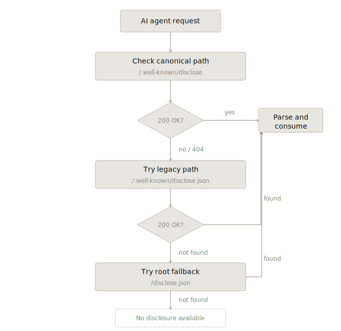

# Disclose Framework

Open-source transparency infrastructure for agentic commerce.

Disclose is an open standard that enables merchants to publish verified, machine-readable disclosures about their business practices — and enables AI agents to consume those disclosures when making or informing purchasing decisions on behalf of buyers.

---

## The Problem

AI agents are increasingly acting as intermediaries between buyers and merchants — researching products, comparing options, and making purchasing recommendations autonomously. Before an agent can responsibly recommend where to buy, it needs to evaluate merchants on operational behaviour: not just price and product, but reliability, trustworthiness, and risk.

Today, no standard exists for merchants to publish this data in a way agents can trust and consume. Agents are flying blind on merchant quality. Disclose solves this.

---

## How It Works

Disclose defines three participants:

- **Merchants** publish a structured disclosure document at `/.well-known/disclose.json` on their own domain
- **Signatories** — authorized third parties with direct access to source data — cryptographically sign attestations confirming the accuracy of specific signals
- **Agents** query disclosure documents, read attestation levels, and use the signals to inform purchasing decisions

The flow is asynchronous and cacheable. Merchants publish; Signatories attest; agents consume. No centralized authority. No real-time negotiation required.

Trust is not assigned by the framework. It emerges from visible, verifiable merchant behaviour.


---

## What Merchants Disclose

Disclose defines a standard attribute set across 12 signal categories covering the core dimensions an agent must evaluate before recommending a purchase:

| Signal Category | Example Attributes |
|---|---|
| Product Quality | Repeat purchase rate, return rate, defect rate |
| Returns & Refunds | Return policy, refund processing time, returnless refund rate |
| Fulfillment | On-time shipment rate, order accuracy, same-day fulfillment rate |
| Inventory & Availability | In-stock rate, inventory accuracy, backorder rate |
| Shipping & Delivery Experience | Delivered on time rate, average transit days, tracking rate |
| Financial Risk | Chargeback rate, dispute win rate, payment method coverage |
| Customer Support | Resolution time, first contact resolution rate, support channels |
| Pricing & Conversion | Average discount rate, price stability, promotional frequency |
| Subscriptions | Churn rate, cancellation availability, skip availability |
| Sustainability & Ethics | Certifications, carbon neutral status, country of manufacture |
| Identity & Legitimacy | Business registration, domain age, platform seller tenure |
| Review Signals | Rating, verified purchase rate, recency, review platform |

Every metric is time-bounded, behaviour-based, and grounded in recorded outcomes — not assertions. Merchants disclose what happened, not what they claim.

61 signals across 12 categories. All optional. All machine-readable.

---

## Core Principles

- **Merchant sovereignty** — participation is voluntary; merchants choose what to disclose, which Signatories to authorize, and when disclosures are updated or removed
- **Selective disclosure** — no all-or-nothing requirement; start with one attribute and add more over time
- **No scores, no badges** — Disclose publishes facts; agents and buyers draw their own conclusions
- **Three attestation tiers** — every signal carries an `attestation_level` of `none` (merchant self-reported), `computed` (pulled from a platform API and calculated by a third-party tool), or `signatory` (cryptographically signed by a Signatory with direct data access). Agents weight signals accordingly
- **Manipulation-resistant by design** — raw, time-bounded, Signatory-attested metrics are far harder to game than scores or badges, which create targets
- **Credentialed query (forthcoming)** — merchants may signal willingness to share non-public attributes with verified agents; a formal query extension is anticipated in a future version

---

## Quick Start

A minimal disclosure document looks like this:

```json
{
  "disclose_version": "0.2",
  "merchant_domain": "merchant.example.com",
  "issued_at": "2026-02-24T00:00:00Z",
  "expires_at": "2026-05-24T00:00:00Z",
  "attributes": {
    "disclose:repeat_purchase_rate": {
      "value": 0.38,
      "observation_window_days": 90,
      "reported_by": "merchant",
      "attestation_level": "none",
      "attestation": null
    },
    "disclose:product_return_rate": {
      "value": 0.06,
      "observation_window_days": 90,
      "source": "shopify_api",
      "reported_by": "merchant",
      "computed_by": "sure_signal",
      "attestation_level": "computed",
      "attestation": null
    },
    "disclose:on_time_shipment_rate": {
      "value": 0.97,
      "observation_window_days": 90,
      "source": "loop_returns",
      "reported_by": "loop_returns",
      "computed_by": "loop_returns",
      "attestation_level": "signatory",
      "attestation": {
        "signatory": "loop_returns",
        "signatory_url": "https://loopreturns.com",
        "signed_at": "2026-02-24T00:00:00Z",
        "signature": "abc123..."
      }
    }
  }
}
```

Publish this at `/.well-known/disclose.json` on your domain. That's a valid Disclose implementation.

---

## Specification

| Document | Description |
|---|---|
| [Specification](specification/overview.md) | Full specification: schema, attributes, attestations, Signatory registry, governance, security, and versioning |

This is a v0.2 draft. The specification is open for review and comment.

---

## Status & Roadmap

This specification is in active development. Current priorities:

**Signatories** — Platforms with direct access to merchant operational data (returns processors, fulfillment providers, post-purchase platforms, payment processors) interested in becoming authorized Signatories. Signatories are listed in the public registry and cryptographically sign attestations for the signals they are authorized to confirm. [See the Signatory Registry governance process →](specification/overview.md#registry-governance)

**Agent platform partners** — AI agent developers and commerce platforms interested in consuming Disclose signals to inform purchasing recommendations.

**Feedback** — Open an Issue with questions, corrections, or proposals. This is an open standard and early input shapes the direction.

---

## Why Now

The shift to agentic commerce is happening faster than the trust infrastructure needed to support it. OpenAI, Google, Meta, and Anthropic are each building commerce layers into their agent platforms. The question of how agents evaluate merchant trustworthiness is unsolved and urgent. Disclose is designed to be the answer — vendor-neutral, open-source, and built for the infrastructure layer, not the application layer.

---

## Contributing

Feedback, corrections, and proposals are welcome via Issues. This is an open standard. The goal is broad adoption, not ownership.

---

## Authors & Maintenance
* **Daniel Whitefield** - *Initial Work / Founder* - [danielwhitefield](https://github.com/danielwhitefield)

---

## License
This project is licensed under the MIT License - see the [LICENSE](LICENSE) file for details.
