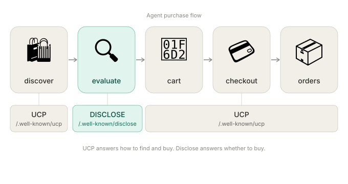
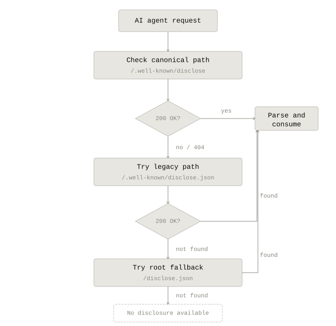

# Disclose Framework

Open-source confidence infrastructure for agentic commerce.

Disclose is an open standard that enables merchants to publish machine-readable operating signals from their own domain, so AI agents can evaluate where to buy before checkout.

Disclose does not certify merchants. It does not produce scores, badges, rankings, or recommendations. Merchants publish operating evidence. Signatories may attest specific signals within authorized scope. Agents decide what the signals mean.

---

## The Problem

AI agents are increasingly acting as intermediaries between buyers and merchants: researching products, comparing options, and making or informing purchasing decisions.

Agents can already read the marketing layer: product descriptions, prices, reviews, availability, and checkout options. They have far less structured access to the operating layer: returns, fulfillment, refunds, delivery reliability, payment risk, seller tenure, and support outcomes.

Without a standard way to publish those signals, agents are forced to infer merchant reliability from incomplete or inconsistent sources.

Disclose gives merchants a standard way to expose operational evidence before the transaction.

---

## How It Works

Disclose defines three participants:

- **Merchants** publish a structured disclosure document at `/.well-known/disclose` on their own domain.
- **Signatories** are authorized third parties that can cryptographically attest to specific signals within their approved scope.
- **Agents** query disclosure documents, read attestation levels, evaluate freshness and provenance, and use the signals according to their own policies.

The flow is asynchronous and cacheable:

```text
Merchant publishes → Signatory attests → Agent consumes → Agent decides
```

No centralized merchant score. No platform lock-in. No real-time negotiation required.





---

## Core Commerce Profile

The first standard profile is the **Core Commerce Profile v0.1**.

It defines seven operating signals that are broadly useful before an agent recommends where to buy:

| Core Signal | What it helps agents evaluate |
|---|---|
| `disclose:product_return_rate` | How often shipped units are returned |
| `disclose:on_time_shipment_rate` | Whether orders leave within the stated fulfillment window |
| `disclose:refund_processing_time_median_days` | How quickly refunds are completed after return receipt |
| `disclose:chargeback_rate` | Payment dispute risk as a proportion of transactions |
| `disclose:dispute_win_rate` | Context for dispute quality and merchant-side transaction integrity |
| `disclose:platform_seller_tenure_days` | How long the merchant has operated on its primary commerce platform |
| `disclose:order_accuracy_rate` | Whether orders are fulfilled without incorrect or damaged items |

Merchants may publish any subset of the Core Commerce signals. A merchant can publish 1/7, 6/7, or 7/7 and remain conformant if every published signal follows the required methodology and metadata rules.

Core coverage is descriptive only. It is not a score, badge, ranking, certification, endorsement, or recommendation.

---

## Signal Freshness

Core Commerce signals represent a **trailing 90-day observation window**.

Automated Core Commerce disclosures SHOULD refresh daily. Each automated Core signal includes freshness metadata such as:

- `generated_at`
- `window_start`
- `window_end`
- `observation_window_days`
- `refresh_frequency`
- `next_expected_refresh`, where available

Manual snapshots may be used for testing, validation, onboarding, or demonstration. They must be clearly declared as manual snapshots and must not imply daily refresh.

---

## Attestation Levels

Every signal carries an `attestation_level`:

| Level | Meaning |
|---|---|
| `none` | Merchant-reported. No third-party computation or signature. |
| `computed` | Derived from a platform API and calculated by a third-party tool, but not cryptographically signed. |
| `signatory` | Cryptographically signed by an authorized Signatory for that specific signal. |

Agents SHOULD treat the attestation level as an important input when evaluating a signal. Disclose does not define how agents should weight signals or combine them.

---

## Quick Start

A minimal computed disclosure document can contain a single Core Commerce signal:

```json
{
  "disclose_version": "0.3",
  "merchant_domain": "merchant.example.com",
  "channel_scope": "dtc",
  "publication_mode": "automated",
  "issued_at": "2026-05-29T00:00:00Z",
  "expires_at": "2026-05-31T00:00:00Z",
  "core_profile": {
    "name": "core-commerce",
    "version": "0.1",
    "signals_defined": 7,
    "signals_disclosed": 1
  },
  "attributes": {
    "disclose:on_time_shipment_rate": {
      "value": 0.95,
      "unit": "ratio",
      "observation_window_days": 90,
      "window_start": "2026-03-01",
      "window_end": "2026-05-29",
      "generated_at": "2026-05-29T00:00:00Z",
      "refresh_frequency": "daily",
      "next_expected_refresh": "2026-05-30T00:00:00Z",
      "source_of_record": "shopify_api",
      "reported_by": "merchant",
      "computed_by": "sure_signal",
      "attestation_level": "computed",
      "methodology_version": "core-commerce-v0.1",
      "attestation": null
    }
  }
}
```

Publish this at:

```text
https://merchant.example.com/.well-known/disclose
```

Agents check this canonical path first. Hosted storefronts that cannot publish to `/.well-known/` may use the supported fallbacks described in the specification.

---

## Broader Attribute Library

Beyond the Core Commerce Profile, Disclose defines a broader optional attribute library across 12 categories:

| Signal Category | Example Attributes |
|---|---|
| Product Quality | Repeat purchase rate, return rate, defect rate |
| Returns & Refunds | Return policy, refund processing time, returnless refund rate |
| Fulfillment | On-time shipment rate, order accuracy, same-day fulfillment rate |
| Inventory & Availability | In-stock rate, inventory accuracy, backorder rate |
| Shipping & Delivery Experience | Delivered on time rate, average transit days, tracking rate |
| Financial Risk | Chargeback rate, dispute win rate, payment method coverage |
| Customer Support | Resolution time, first contact resolution rate, support channels |
| Pricing & Conversion | Average discount rate, price stability, promotional frequency |
| Subscriptions | Churn rate, cancellation availability, skip availability |
| Sustainability & Ethics | Certifications, carbon neutral status, country of manufacture |
| Identity & Legitimacy | Business registration, domain age, platform seller tenure |
| Review Signals | Rating, verified purchase rate, recency, review platform |

These attributes are optional and may be formalized into additional profiles over time.

---

## Core Principles

- **Merchant sovereignty**: participation is voluntary; merchants choose what to expose, which Signatories to authorize, and when disclosures are updated or removed.
- **Selective disclosure**: Disclose standardizes how a signal is expressed, not whether a merchant must expose it.
- **No scores, no badges, no rankings**: Disclose publishes structured evidence. Agents decide what the signals mean.
- **Source clarity**: signals distinguish source of record, computed publisher, attestation level, methodology version, and freshness.
- **Authorized attestation**: Signatories attest only specific signals within authorized scope.
- **Agent discretion**: agents may use Disclose signals in their own recommendation logic, but Disclose itself does not recommend merchants.
- **Credentialed query, forthcoming**: future extensions may define how verified agents request non-public attributes directly from merchant infrastructure.

---

## Specification

| Document | Description |
|---|---|
| [Getting Started](specification/getting-started.md) | Quick start guide for publishing a first disclosure document |
| [Specification](specification/overview.md) | Full specification: schema, Core Commerce Profile, attributes, sources, attestations, Signatory registry, governance, security, and versioning |

This is a v0.3 draft. The specification is open for review and comment.

---

## Status & Roadmap

This specification is in active development. Current priorities:

**Core Commerce Profile**  
Finalize the first seven operating signals, methodology definitions, freshness rules, and validation requirements.

**Signatories**  
Identify platforms with direct access to merchant operational data, including returns processors, fulfillment providers, post-purchase platforms, payment processors, review platforms, and commerce platforms. Signatories are listed in the public registry and may attest only the signals they are authorized to confirm.

**Agent platform partners**  
Work with AI agent developers, shopping agents, MCP servers, and commerce platforms interested in consuming Disclose signals before recommending where to buy.

**Reference tooling**  
Maintain a JSON schema, validator, sample disclosure documents, and mock Signatory implementation.

**Governance path**  
Disclose is currently maintained as an open framework. It is intended to graduate into a protocol governed by a credible working group once there is sufficient participation from merchants, agents, platforms, and Signatories.

---

## Why Now

Agentic commerce is moving faster than the infrastructure needed to support merchant evaluation.

Checkout and payment protocols can help agents transact. Disclose addresses the step before checkout: giving agents structured merchant operating signals so they can evaluate where to buy.

The goal is vendor-neutral, open-source infrastructure for the agent layer.

---

## Contributing

Feedback, corrections, and proposals are welcome via Issues.

Useful contributions include:

- methodology improvements for Core Commerce signals
- example disclosure documents
- parser and validator feedback
- Signatory registry proposals
- agent consumption guidance
- governance and working group proposals

This is an open standard. The goal is broad adoption, not ownership.

---

## Authors & Maintenance

- **Daniel Whitefield** - Initial work / Founder - [danielwhitefield](https://github.com/danielwhitefield)

---

## License

This project is licensed under the MIT License. See the [LICENSE](LICENSE) file for details.
